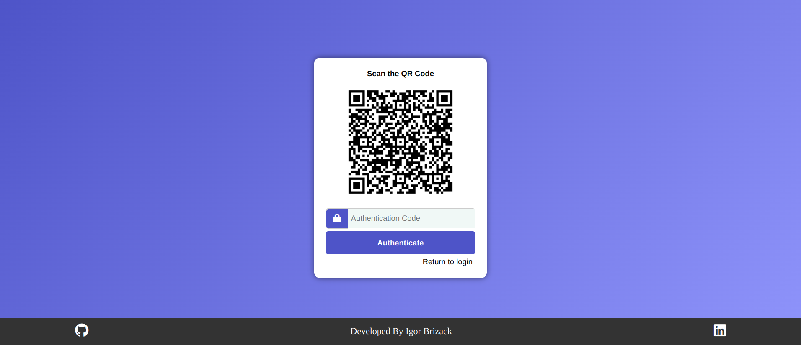

# Multi Factor Authentication

<div style="display: flex; gap: 10px;">
  
  
  
</div>

**`En-US`**

## About this project

This project is created with Angular to build the Frontend. The goal of this project is to implement elements that simulate a real interaction for logging into a web application with two-factor authentication. In this project, you will learn how to implement guards, services, create components, and design views. To have the full experience on your computer you will need to clone the [Backend](https://github.com/IgorBrizack/mfa-authentication-backend).

## Steps

1.  **Clone the repository**

```
git@github.com:IgorBrizack/mfa-authentication-front.git
```

2. **Run with Docker**

```
docker-compose up -d --build
```

3. **Run with Node**

```
npm install
ng start
```

4. **Start the [Backend](https://github.com/IgorBrizack/mfa-authentication-backend) and setup your envs**

---

**`Pt-BR`**

# Sobre este projeto

Este projeto foi criado com Angular para construir o Frontend. O objetivo deste projeto é implementar elementos que simulem uma interação real para fazer login em uma aplicação web com autenticação de dois fatores. Neste projeto, você aprenderá a implementar guards, services, criar componentes e projetar views. Para ter a experiência completa em seu computador será necessário clonar o [Backend](https://github.com/IgorBrizack/mfa-authentication-backend).

## Passos

1. **Clone o repositório**:

   ```bash
   git@github.com:IgorBrizack/mfa-authentication-front.git
   ```

2. **Execute com Docker**:

   ```bash
   docker-compose up -d --build
   ```

3. **Execute com Node**:

   ```bash
   npm install
   ng start
   ```

4. **Inicie o [Backend](https://github.com/IgorBrizack/mfa-authentication-backend) e configure suas variáveis de ambiente.**
